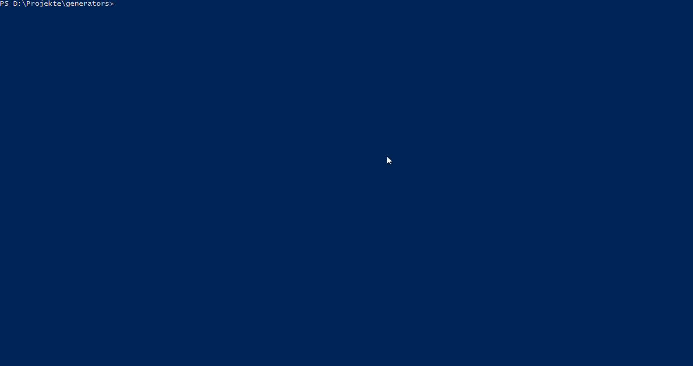

# generator-kodi-addon [![NPM version][npm-image]][npm-url] [![Build Status][travis-image]][travis-url] [![Dependency Status][daviddm-image]][daviddm-url] [![Development Dependency Status][daviddm-image-dev]][daviddm-url-dev] [![Coverage percentage][coveralls-image]][coveralls-url]
> Creates the basic structure for a kodi script, written in python.



## Installation

First, install [Yeoman](http://yeoman.io) and generator-kodi-addon using [npm](https://www.npmjs.com/) (we assume you have pre-installed [node.js](https://nodejs.org/)).

```bash
npm install -g yo
npm install -g generator-kodi-addon
```

Then generate your new project:

```bash
yo kodi-addon
```

## Development

 - Check out this project via git
 - Browse to the folder via commandline
 - Do `npm link`
 - Now you can use `yo kodi-addon`, which should include your changes.

## License

Apache-2.0 © [Kolja Lampe]()


[npm-image]: https://badge.fury.io/js/generator-kodi-addon.svg
[npm-url]: https://npmjs.org/package/generator-kodi-addon
[travis-image]: https://travis-ci.org/xbmc/generator-kodi-addon.svg?branch=master
[travis-url]: https://travis-ci.org/xbmc/generator-kodi-addon
[daviddm-image]: https://david-dm.org/xbmc/generator-kodi-addon.svg?theme=shields.io
[daviddm-url]: https://david-dm.org/xbmc/generator-kodi-addon
[daviddm-image-dev]: https://david-dm.org/xbmc/generator-kodi-addon/dev-status.svg
[daviddm-url-dev]: https://david-dm.org/xbmc/generator-kodi-addon?type=dev
[coveralls-image]: https://coveralls.io/repos/xbmc/generator-kodi-addon/badge.svg
[coveralls-url]: https://coveralls.io/r/xbmc/generator-kodi-addon
